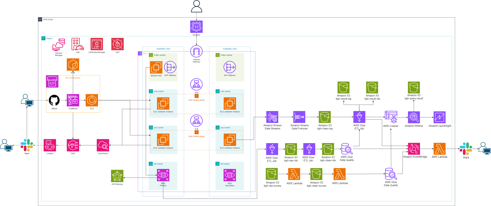

# AWS 클라우드 최종 프로젝트

 

## 프로젝트 주제
쇼핑몰 인프라 구축 및 데이터 분석

 

## 프로젝트 기간
| 구분 | 기간 | 총 기간 | 비고 |
| -- | -- | -- | -- |
| 기간 | 2024.04.05 ~ 2024.06.25 | 2개월 |  |

 

## 팀원 소개

| 이름   | 직위                  | 역할                       |
|---------|------------------------|-----------------------------|
|  나지원  | 팀장     | 설문조사 데이터 수집 파이프라인 및 알람 구축  |
| 김건호   | 팀원    | 로그 수집 파이프라인 및 분석         |
| 김민경   | 팀원   | 데이터 시각화            |
| 이혜성   | 팀원   | 데이터 전처리 및 자동화            |

 

## 전체 구성도

 

## 데이터 파이프라인

